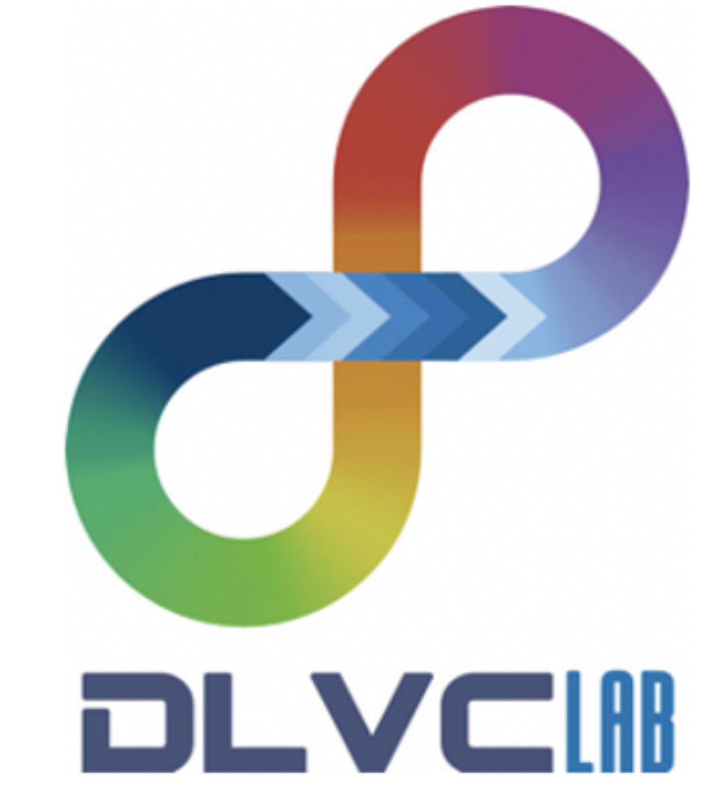

# GPT4OCR

  

      </a>
  

  
  
  

[English](README.md) | [简体中文](README.zh-CN.md)
 

评测GPT-4V(ision)在各种OCR相关任务上的性能。 

<!-- 

    

 -->

<h2>场景文本识别</h2>

<h2>手写文本识别</h2>

<h2>手写数学公式识别</h2>

<h2>视觉信息抽取</h2>

    
    <!--  -->
    

了解更多关于视觉信息抽取的信息，请参考[Document-AI-Recommendations](https://github.com/SCUT-DLVCLab/Document-AI-Recommendations/tree/main).

视觉信息抽取（Visual Information Extraction, VIE）旨在挖掘、分析和提取视觉富文档中包含的关键信息字段。例如，给定一张收据的图像，VIE算法将告诉诸如商店名称、产品详情、价格等信息。对于表格等文档，VIE算法将抽取出其包含的键值对。

<h2>表格结构识别</h2>

了解更多关于视觉信息抽取的信息，请参考[Document-AI-Recommendations](https://github.com/SCUT-DLVCLab/Document-AI-Recommendations/tree/main).

<!-- <h2>版面分析</h2> -->

