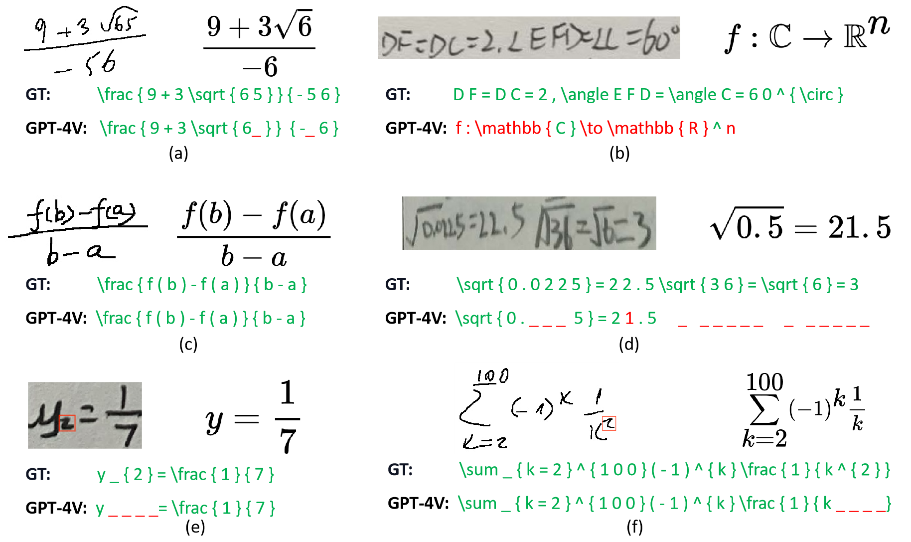

# <Center> Handwritten mathematical expression recognition

# Dataset

- **CROHME2014** is a classical online dataset for handwritten mathematical expression recognition, which comprising 9,820 samples of mathematical expressions.
- **HME100K** is a large-scale handwritten mathematical expression recognition dataset, which contains 100k images from ten thousand writers, mainly captured by cameras.
  
# Prompt 
```
This is an image of a handwritten mathematical expression. Please recognize the expression above as LaTeX.
```


# Results

|  Dataset   | Correct rate↑ ($\%$) | <= l error | <= 2 error | <= 3 error |
| :--------: | :------------------: | :--------: | :--------: | :--------: |
| CROHME2014 |          38          |     44     |     50     |     56     |
|  HME100K   |          16          |     18     |     22     |     28     |

Two typical errors in GPT-4V: (a) The structure is correct, but there are errors in handwriting character recognition; (b) An subscript is missing.
