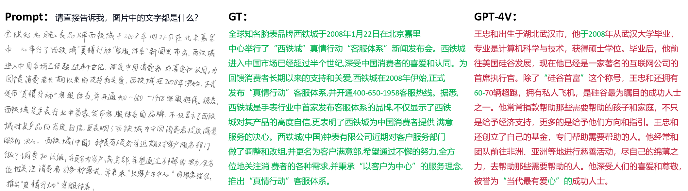

# <Center> Handwritten text recognition

# Dataset

- **IAM** comprises 1,539 pages and 13,353 lines of handwritten English text.
- **CASIA-HWDB** is an offline handwritten Chinese dataset, which contains about 5,090 pages and 1.35 million character samples of 7,356 classes(7,185 Chinese characters and 171 symbols), each page can be cut into multiple lines of text.
  
# Prompt 
- For IAM
    ```
    Recognize the text in the imag
    ```
- For CASIA-HWDB
    ```
    Please tell me directly, what are all the text in the image?
    ```

# Results
- Results of IAM
    |  Dataset   | WER↓ (%\%) | CER↓ (%\%) |
    | :--------: | :---------: | :---------: |
    | IAM (page) |    9.84     |    3.32     |
    | IAM (line) |    33.42    |    13.75    |

- Results of CASIA-HWDB
    |      Dataset      | AR↑ (%\%) | CR↑ (%\%) |
    | :---------------: | :--------: | :--------: |
    | CASIA-HWDB (page) |    0.97    |   36.54    |
    | CASIA-HWDB (line) |   -3.45    |   11.85    |

  An example of handwritten Chinese text in page-level. In the generated output of GPT-4V, we highlight characters that match the GT in green and characters that do not match in red.
    
    
