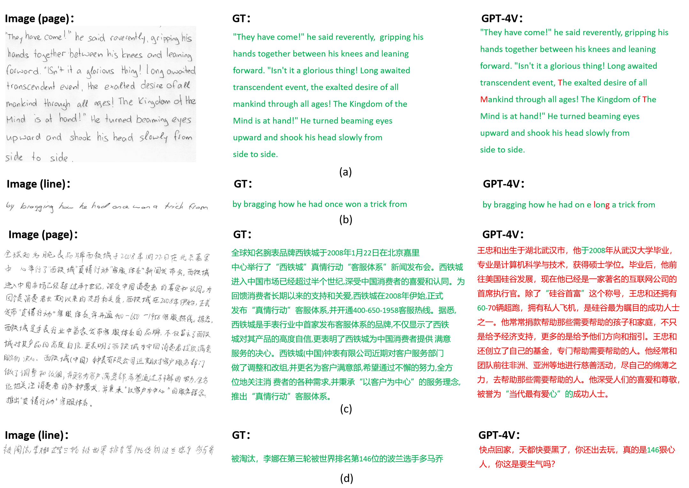

# <Center> Handwritten text recognition

# Dataset

- **IAM** comprises 1,539 pages and 13,353 lines of handwritten English text.
- **CASIA-HWDB** is an offline handwritten Chinese dataset, which contains about 5,090 pages and 1.35 million character samples of 7,356 classes (7,185 Chinese characters and 171 symbols).
  
# Prompt 
- For IAM
    ```
    Recognize the text in the image.
    ```
- For CASIA-HWDB
    ```
    请直接告诉我，图片中的文字都是什么？
    ```

# Results
- Results of IAM
    <table>
        <tbody>
        <tr>
            <td rowspan="2">Method</td>
            <td colspan="2">Page-level</td>
            <td colspan="2">Line-level</td>
        </tr>
        <tr>
            <td>WER↓</td>
            <td>CER↓</td>
            <td>WER↓</td>
            <td>CER↓</td>
        </tr>
        <tr>
            <td>GPT-4V</td>
            <td>9.84%</td>
            <td>3.32%</td>
            <td>33.42%</td>
            <td>13.75%</td>
        </tr>
        <tr>
            <td>Supervised-SOTA</td>
            <td>8.29%</td>
            <td>2.89%</td>
            <td>6.52%</td>
            <td>21.47%</td>
        </tr>
    </table>

- Results of CASIA-HWDB
    <table>
        <tbody>
        <tr>
            <td rowspan="2">Method</td>
            <td colspan="2">Page-level</td>
            <td colspan="2">Line-level</td>
        </tr>
        <tr>
            <td>AR↑</td>
            <td>CR↑</td>
            <td>AR↑</td>
            <td>CER↑</td>
        </tr>
        <tr>
            <td>GPT-4V</td>
            <td>0.97%</td>
            <td>36.54%</td>
            <td>-3.45%</td>
            <td>11.85%</td>
        </tr>
        <tr>
            <td>Supervised-SOTA</td>
            <td>92.86%</td>
            <td>93.24%</td>
            <td>97.70%</td>
            <td>97.91%</td>
        </tr>
    </table>

 - Illustration of handwritten text recognition. (a), (b), (c), (d) are samples of page-level IAM, line-level IAM, page-level CASIA-HWDB and line-level CASIA-HWDB, respectively. In the responses of GPT-4V, we highlight characters that match the GT in green and characters that do not match in red. For English text, GPT-4V demonstrates excellent performance. In contrast, for Chinese text, GPT-4V has generated a passage of text that is semantically coherent, but it is not associated with the ground truth text (GT).
    
    
