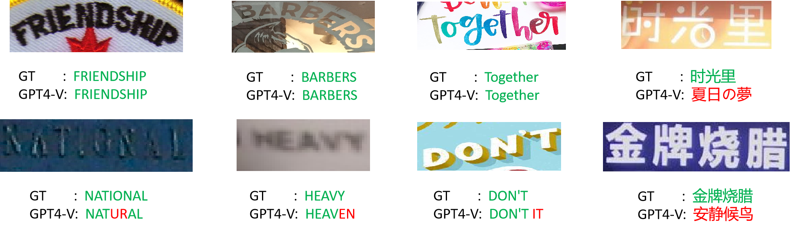

# <Center> Scene text recognition

# Dataset

## Word-level text recognition

   - **CUTE80**  is the first curved text dataset that consists of 80 curved text images.
   - **SCUT-CTW1500**  is a curved text dataset, which includes over 10,000 text annotations in 1500 images.
   - **Total-Text** has 1,555 scene images, 9,330 annotated words with 3 different text orientations including horizontal, multi-oriented, and curved text.
   - **WordArt** is a dataset which primarily features challenging artistic text.
   - **ReCTS**  is a large-scale dataset of 25,000 images, which mainly focuses on reading Chinese text on signboard.
## End-to-end text recognition
   - **MLT19**  is a real dataset for Multi-Lingual scene Text (MLT) detection and recognition, which consists of 20,000 images containing text from 10 languages.

# Prompt
- For word-level text recognition
    ```
    What is the scene text in the image?
    ```
- For end-to-end text recognition
    ```
    What are all the scene text in the image? Do not translate.
    ```
- For ReCTS in Chinese
    ```
    图片中的场景文字是什么？
    ```

# Results
- Results of word-level secne text recognition.
   |     Method      | CUTE80 | SCUT-CTW1500 | Total-Text | WordArt | ReCTS |
   | :-------------: | :----: | :----------: | :--------: | :-----: | :---: |
   |     GPT-4V      | 88.0%  |    62.0%     |   66.0%    |  62.0%  |   0   |
   | Supervised-SOTA | 98.6%  |    87.0%     |   90.1%    |  68.2%  | 94.0% |

- Results of MLT19.
  <table>
        <tbody>
        <tr>
            <td>Method</td>
            <td>Language</td>
            <td>Precision ↑</td>
            <td>Recall ↑</td>
            <td>F1 ↑</td>
        </tr>
        <tr>
            <td rowspan="11">GPT-4V</td>
            <td>Arabic</td>
            <td>16.44%</td>
            <td>16.67%</td>
            <td>16.55%</td>
        </tr>
        <tr>
            <td>English</td>
            <td>86.57%</td>
            <td>78.77%</td>
            <td>82.49%</td>
        </tr>
        <tr>
            <td>French</td>
            <td>83.0%</td>
            <td>83.84%</td>
            <td>83.42%</td>
        </tr>
        <tr>
            <td>Chinese</td>
            <td>1.2%</td>
            <td>1.56%</td>
            <td>1.36%</td>
        </tr>
        <tr>
            <td>German</td>
            <td>73.65%</td>
            <td>86.29%</td>
            <td>79.47%</td>
        </tr>
        <tr>
            <td>Korean</td>
            <td>10.83%</td>
            <td>12.39%</td>
            <td>11.56%</td>
        </tr>
        <tr>
            <td>Japanese</td>
            <td>11.9%</td>
            <td>11.9%</td>
            <td>11.9%</td>
        </tr>
        <tr>
            <td>Italian</td>
            <td>62.7%</td>
            <td>67.52%</td>
            <td>65.02%</td>
        </tr>
        <tr>
            <td>Bangla</td>
            <td>2.53%</td>
            <td>2.63%</td>
            <td>2.58%</td>
        </tr>
        <tr>
            <td>Hindi</td>
            <td>7.29%</td>
            <td>8.33%</td>
            <td>7.78%</td>
        </tr>
        <tr>
            <td>All language</td>
            <td>43.04%</td>
            <td>45.42%</td>
            <td>44.2%</td>
        </tr>
        <tr>
            <td>Supervised-SOTA</td>
            <td>All language</td>
            <td>74.16%</td>
            <td>52.91%</td>
            <td>61.76%</td>
        </tr>
   


- Impact of image resolution for recognition performance on MLT19 English subset.
   | Image size | Precision ↑ | Recall ↑ |  F1 ↑  |
   | :--------: | :---------: | :------: | :----: |
   |    128     |   47.10%    |  58.88%  | 52.34% |
   |    256     |   74.64%    |  86.67%  | 80.21% |
   |    512     |   86.23%    |  83.69%  | 84.94% |
   |    1024    |   90.58%    |  85.14%  | 87.78% |
   |    2048    |   92.75%    |  89.12%  | 89.46% |

- Illustration of word-level scene text recognition. In the answers of GPT-4V, we highlight the characters match the GT in green and characters do not match in red. GPT-4V can recognize curved, slanted and artistic English text, while comman-style Chinese text can not be recognized.
