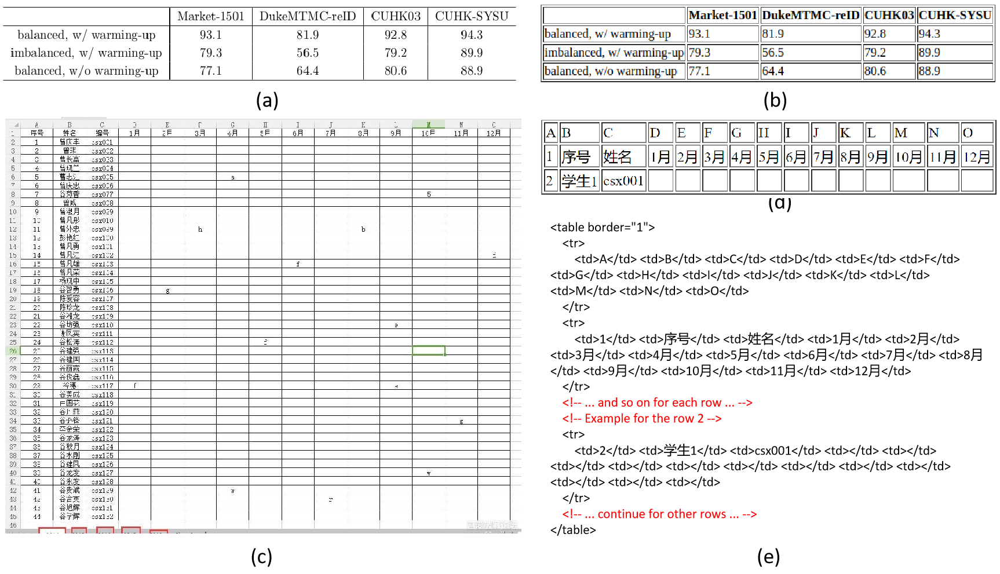

# <Center> Table structure recognition

# Dataset

- **SciTSR** is a dedicated dataset created to address the task of table structure recognition in scientific papers. The dataset consists of 12,000 training samples and 3,000 test samples.
- **WTW**’s images are collected in the wild. The dataset is split into training/testing sets with 10,970 and 3,611 samples respectively. 
  
# Prompt 
```
Please read the table in this image and return a html-style reconstructed table in text, do not omit anything.
```

# Results
- The TEDS-S of SciTSR and WTW.
  
    |     Method      | SciTSR |  WTW   |
    | :-------------: | :----: | :----: |
    |     GPT-4V      | 87.47% | 25.60% |
    | Supervised-SOTA | 99.19% | 91.91% |

- Illustration of table structure recognition. (a) and (c) are two input images, (b) and (d) are the corresponding visualized images of GPT-4V's html-style output sequence. (e) is the output sequence of (c), where the elements that GPT-4V indicate the ommited content are highlighted in red.
  
