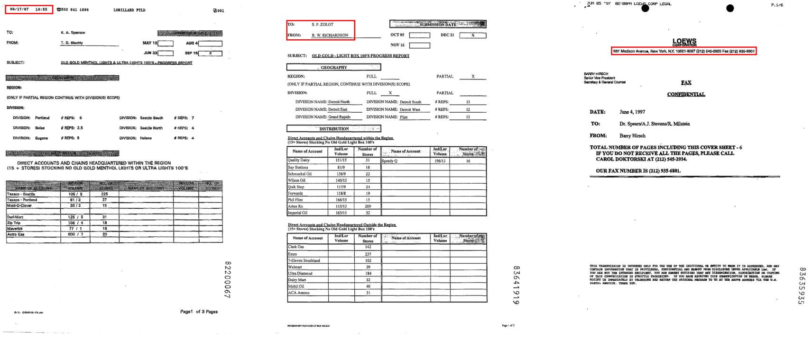

# <Center> Visually-rich Documents Information Extraction

# Dataset

## Word-level text recognition

   - **FUNSD**  dataset is a commonly used form understanding benchmark, which contains 199 scanned form-like documents with noisy images.
   - **XFUND**  dataset is a multilingual extension of FUNSD that convers seven languages (Chinese, Japanese, French, Italian, German, Spanish, and Portuguese)


# Prompt
- For FUNSD, we use the following prompt for SER:
    ```
    Please read the text in this image and return the information in the following JSON format (note xxx is placeholder, if the information is not available in the image, put "N/A" instead). "header": [xxx, ...], "key": [xxx, ...], "value": [xxx, ...]
    ```
- For end-to-end pair extraction, we use the following prompt:
    ```
    You are a document understanding AI, who reads the contents in the given document image and tells the information that the user needs. Respond with the original content in the document image, do not reformat. No extra explanation is needed. Extract all the key-value pairs from the document image.
    ```

# Results
- SER Results of FUNSD and XFUND-zh
  
    | Dataset  | Precision↑ ($\%$) | Recall↑ ($\%$) | F1↑ ($\%$) | 1-NED↑ |
    | :------: | :---------------: | :------------: | :--------: | :----: |
    |  FUNSD   |       41.85       |     29.36      |   34.51    | 0.2697 |
    | XFUND-zh |       25.87       |     15.15      |   19.11    | 0.1544 |

 - Pair Extraction Results of FUNSD and XFUND-zh.
    | Dataset  | Precision↑ ($\%$) | Recall↑ ($\%$) | F1↑ ($\%$) | 1-NED↑ |
    | :------: | :---------------: | :------------: | :--------: | :----: |
    |  FUNSD   |       20.69       |     10.25      |   13.71    | 0.1979 |
    | XFUND-zh |       0.07        |      0.02      |    0.03    | 0.0420 |

 - Examples of error cases of the SER task. 
    The text content enclosed within the red box is incorrectly identified as a header entity
    